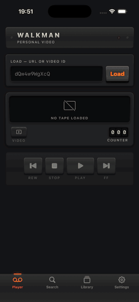

# Walkman

A personal iOS video player that treats YouTube like a tape deck: paste a link,
play it, record it to the device, and file it onto your own tapes.



## What it does

- **Paste and play.** Accepts a bare video ID or any YouTube URL shape —
  `watch?v=`, `youtu.be`, `/shorts/`, `/embed/`, `/live/`, `youtube-nocookie`,
  with or without a scheme.
- **Four tabs:** Player, Search, Library and Settings. The deck keeps playing
  whichever tab you're on, and playing something from the Library takes you
  back to it.
- **A cassette in the deck.** While a video plays, the window shows the tape
  instead of the picture: the video's artwork printed on the label, the title
  in marker, and the hubs turning as the tape winds from one pack to the other.
  A key under the window flips to the picture when you want to watch.
- **Plays in the background.** Audio keeps going when the app is backgrounded
  or the screen locks, with transport controls on the lock screen and in
  Control Center, plus Picture in Picture.
- **Records to the device.** A REC key saves a real `.mp4` you can play back
  with no network at all.
- **Tapes.** Named, ordered playlists. Reorder them, and play straight through
  with a two-second gap between tracks, wrapping at the end like a tape side.
- **A searchable catalogue** of everything you've played, with artwork.
- **Search YouTube** from its own tab. Results show artwork, title, channel and
  the description snippet; open one to preview it — streamed natively at around
  480p so it starts quickly — then file it into All Recordings or onto any of
  your tapes without playing it.
- **Tapes of similar tracks.** From a search result, Last.fm names the song and
  suggests 20 like it; each is found on YouTube and laid out as a draft tape to
  prune, reorder, preview and save. Needs a free Last.fm API key, entered in
  Settings.

## How it works

### Getting a playable stream

[`StreamResolver`](Walkman/Players/StreamResolver.swift) turns a video ID into a
set of qualities using [YouTubeKit](https://github.com/alexeichhorn/YouTubeKit).

The wrinkle is that YouTube only publishes muxed (video **and** audio in one
file) streams up to **360p**. Everything above that is *adaptive*: separate
video-only and audio-only files. So for 480p–1080p the resolver loads both
tracks into an `AVMutableComposition`, which `AVPlayer` then streams as if it
were a single asset. Livestreams fall back to the HLS manifest, which `AVPlayer`
handles natively.

Building that composition is slow at high resolutions: AVFoundation reads
through much of the video file before it will play, so 1080p can take over ten
seconds. To start right away, the deck first plays the 360p pair, which is
ready in about a second, and switches to the full quality at the same position
once it's built.

### Background playback

Three things have to line up: the `audio` background mode, an `AVAudioSession`
in the `.playback` category, and — the non-obvious one — detaching the player
from its layer on the way to the background.

iOS suspends video decoding when a layer is attached in a backgrounded app,
which stops the audio too.
[`VideoSurface`](Walkman/Players/VideoSurface.swift) drops the player from the
`AVPlayerViewController` when the app backgrounds and reattaches it on return.
Picture in Picture is the exception: while it's active the layer must stay put.

### Recording to the device

A download is produced by exporting the same composition the player uses,
through `AVAssetExportSession` in **passthrough** mode. That remuxes the
existing H.264 and AAC tracks into an MP4 container with no re-encoding, so a
1080p recording is fast and lossless rather than a 360p re-compression.

The presence of the file on disk is the only source of truth for "is this
recorded", so local copies survive clearing the catalogue.

A recording with a local copy is always played by `AVPlayer`, whatever the
Player setting says — the web view can neither reach the file nor keep playing
in the background.

### Running order

[`PlayQueue`](Walkman/Model/PlayQueue.swift) holds a **snapshot** of whatever
list you started playing from. It has to be a snapshot: playing a recording
bumps it to the top of the catalogue, so re-deriving the order after each track
would make the sequence eat itself and loop between two videos.

### Two players

The native path above is the default. An **Embedded** option still runs
YouTube's own IFrame player in a `WKWebView`, kept as a fallback for when
extraction breaks — YouTube changes its unofficial API from time to time. It
can't play in the background. There's also a remote-extraction fallback that
routes through YouTubeKit's server when local extraction fails.

## Running it on your iPhone

Written for someone who has never built an iOS app. Budget about half an hour,
most of which is Xcode downloading.

### What you need

- A Mac that can run **Xcode 26** (free from the Mac App Store, ~15 GB).
- An **iPhone on iOS 17 or later**, and its cable.
- An **Apple ID**. A free one is enough — you do *not* need the paid
  $99/year Apple Developer Program.

|                              | Free Apple ID | Developer Program |
| ---------------------------- | ------------- | ----------------- |
| App keeps working for        | 7 days        | 1 year            |
| Sideloaded apps at once      | 3             | no practical limit |
| New app IDs per week         | 10            | no practical limit |

Everything in this app — including background audio — works on a free account.
The only real cost is reinstalling once a week.

### 1. Install the tools

Install Xcode from the Mac App Store, open it once and accept the licence
prompt. Then:

```sh
xcode-select --install                  # command line tools, if you don't have them
brew install xcodegen                   # see brew.sh if you don't have Homebrew
```

### 2. Sign in to Xcode with your Apple ID

**Xcode → Settings (⌘,) → Accounts → + → Apple ID**, and sign in. A team called
*"Your Name (Personal Team)"* appears. That is your free team.

### 3. Let Xcode issue you a signing certificate

```sh
xcodegen generate
open Walkman.xcodeproj
```

In Xcode, select the **Walkman** target → **Signing & Capabilities** tab → tick
**Automatically manage signing** → choose your team in the **Team** dropdown.
Xcode creates a development certificate for you. Ignore any error about the
bundle identifier for now; step 4 fixes it.

### 4. Set your team and your own bundle identifier

A bundle identifier is the app's globally unique name across all of Apple, so
you **cannot** reuse mine — you'll get *"Failed Registering Bundle Identifier"*
if you try. Pick something based on your own name or domain.

Find your Team ID — ten characters like `7DZ8FR94Q3`:

```sh
security find-identity -v -p codesigning \
  | sed -n 's/.*"\(Apple Development: .*\)"/\1/p' | head -1 \
  | xargs -I{} security find-certificate -c "{}" -p \
  | openssl x509 -noout -subject | tr '/' '\n' | grep '^OU=' | cut -d= -f2
```

Then edit **`project.yml`** — five values in total:

```yaml
options:
  bundleIdPrefix: com.yourname              # was com.carlopascoli

settings:
  base:
    DEVELOPMENT_TEAM: ABCDE12345            # your Team ID from above

# ...and the three bundle identifiers further down:
        PRODUCT_BUNDLE_IDENTIFIER: com.yourname.walkman
        PRODUCT_BUNDLE_IDENTIFIER: com.yourname.walkman.tests
        PRODUCT_BUNDLE_IDENTIFIER: com.yourname.walkman.uitests
```

Regenerate the Xcode project so the changes take effect:

```sh
xcodegen generate
```

> **Why not just change it in Xcode?** You can, but `project.yml` is the source
> of truth and `xcodegen generate` overwrites the project file. Anything you
> change only in Xcode's UI will be lost the next time the project is
> regenerated.

### 5. Connect your iPhone

Unlock the phone, plug it in, tap **Trust** when it asks, and enter your
passcode. Check the Mac can see it:

```sh
xcrun devicectl list devices
```

Your iPhone should be listed as `connected`.

### 6. Build and install

**In Xcode** (easiest): pick your iPhone from the device menu in the toolbar,
then press **⌘R**.

**Or from the terminal:**

```sh
# build and sign
xcodebuild -project Walkman.xcodeproj -scheme Walkman \
  -destination 'generic/platform=iOS' -allowProvisioningUpdates build

# find the built app
APP=$(xcodebuild -project Walkman.xcodeproj -scheme Walkman \
  -destination 'generic/platform=iOS' -showBuildSettings \
  | awk -F' = ' '/ BUILT_PRODUCTS_DIR /{print $2}' | head -1)

# install it (use the Identifier from `devicectl list devices`)
xcrun devicectl device install app --device <YOUR-DEVICE-IDENTIFIER> "$APP/Walkman.app"
```

### 7. Trust the app on your iPhone

The first launch will say **"Untrusted Developer"**. On the phone:

**Settings → General → VPN & Device Management →** under *Developer App*, tap
your Apple ID **→ Trust**.

Then open Walkman from the home screen.

### 8. A week later

With a free Apple ID the signature expires after 7 days and the app stops
opening. Repeat step 6 to reinstall it. Your tapes, catalogue and recordings
survive as long as you don't delete the app.

### If something goes wrong

| Message | What it means | Fix |
| ------- | ------------- | --- |
| `The executable is not codesigned` | No signing team is set | Step 4 |
| `Failed Registering Bundle Identifier … not available` | Someone already owns that bundle ID | Choose your own in step 4 |
| `No profiles for 'com.…' were found` | Xcode hasn't created a provisioning profile yet | Add `-allowProvisioningUpdates`, or press Run in Xcode once |
| `Untrusted Developer` on the phone | The app is installed but not trusted | Step 7 |
| iPhone missing from `devicectl list devices` | Not paired | Unlock the phone, reconnect, tap *Trust This Computer* |
| `Unable to install … maximum number of apps` | Free accounts allow 3 sideloaded apps | Delete another sideloaded app |

## Building (if you already know Xcode)

Requires Xcode 26, iOS 17+, and [XcodeGen](https://github.com/yonaskolb/XcodeGen).

```sh
brew install xcodegen
xcodegen generate
open Walkman.xcodeproj
```

`project.yml` is the source of truth — the `.xcodeproj` is generated, so run
`xcodegen generate` after changing targets, files or settings. Set
`DEVELOPMENT_TEAM` and the bundle identifiers in `project.yml`, not in Xcode.

## Tests

```sh
xcodebuild test -project Walkman.xcodeproj -scheme Walkman \
  -destination 'platform=iOS Simulator,name=iPhone 17 Pro'
```

Unit tests cover URL parsing, queue rotation and wrap-around, and the tape
library. The UI tests are end-to-end against live YouTube — they stream a
video, record it, file it onto a tape, and check that continuous play advances
on its own. That makes them slower and occasionally flaky, which is the trade
for catching extraction breaking.

How well the app recognises which song a video is — the step that seeds a tape
of similar tracks — is measured separately against 65 hand-labelled videos; see
[Tools/SongIDEval](Tools/SongIDEval/README.md).

The similar-tapes test also calls Last.fm, so it needs an API key. It's
skipped unless you pass one:

```sh
TEST_RUNNER_LASTFM_API_KEY=your-key xcodebuild test -project Walkman.xcodeproj \
  -scheme Walkman -destination 'platform=iOS Simulator,name=iPhone 17 Pro'
```

## Regenerating the demo

Run this **by hand**, and only when a change is worth showing — it is
deliberately not part of the build or test flow. Each recording commits a fresh
~4.5 MB binary, and the GIF stays accurate across most changes, so re-recording
routinely just grows the history for nothing.

```sh
LASTFM_API_KEY=… Tools/record-demo.sh         # defaults
SPEEDUP=2.5 FPS=6 WIDTH=280 KEEP_CAPTURE=1 \
  Tools/record-demo.sh                        # retune without re-recording
```

Without `LASTFM_API_KEY` the walkthrough leaves out making a tape of similar
tracks. The simulator's boot and home screen are trimmed from both ends.

Drives the app through `DemoWalkthrough` while recording the simulator, then
builds `Docs/demo.gif`. `KEEP_CAPTURE=1` keeps the `.mov` so the encoding can be
adjusted without sitting through another capture.

The GIF is kept small by sharing one palette across frames so only changes are
stored, and by skipping dithering. The seeded accent colours in
`Tools/build-gif.py` exist because median cut otherwise spends the entire
palette on dark greys and renders the amber as brown.

The app icon is generated too, by `Tools/make-icon.swift`.

## Caveats

This is a personal project, not something to ship.

- Downloading YouTube videos conflicts with YouTube's Terms of Service.
- *Walkman* is a Sony trademark. Fine for an app on your own phone; not a name
  you could publish under.
- Extraction depends on YouTube's unofficial API and will break when they
  change it. The remote fallback buys time; updating YouTubeKit is the fix.
